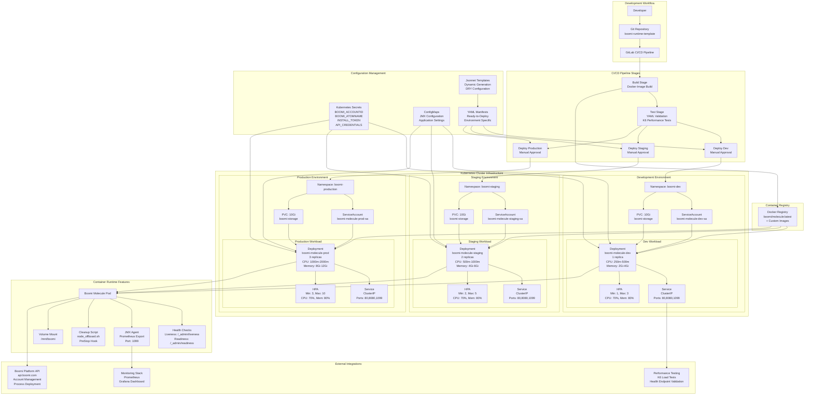
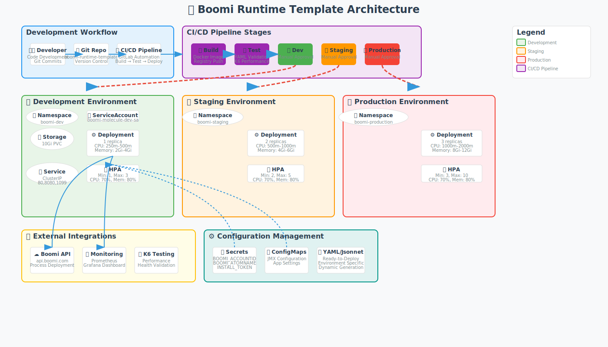

# Boomi Runtime Template

A simplified Kubernetes deployment template for Boomi Molecule runtime environments.

## Overview

This template provides a clean, minimal deployment solution for Boomi Molecule runtime environments on Kubernetes with basic monitoring and automation capabilities.

### Key Features

- **Multi-Environment Support**: Separate configurations for dev, staging, and production
- **Kubernetes Native**: Standard Kubernetes resources with minimal complexity
- **JMX Monitoring**: Built-in Prometheus JMX exporter
- **Automated CI/CD**: GitLab CI pipeline ready
- **Performance Testing**: K6 performance testing included
- **Node Cleanup**: Automated node offboarding on container termination

## Architecture

The following diagram illustrates the comprehensive architecture and deployment flow of the Boomi Runtime Template:



### Architecture Components

- **Development Workflow**: Git-based development with CI/CD integration
- **CI/CD Pipeline**: Automated GitLab-based build, test, and deployment pipeline with manual approvals
- **Multi-Environment**: Isolated Kubernetes namespaces (dev/staging/production) with environment-specific resources
- **Container Runtime**: Boomi Molecule containers with integrated monitoring, health checks, and autoscaling
- **Storage**: Persistent volumes for runtime data with 10Gi storage per environment
- **External Integrations**: Boomi Platform API, Prometheus monitoring, and K6 performance testing
- **Configuration Management**: Kubernetes secrets, ConfigMaps, YAML manifests, and Jsonnet templates
- **Security**: Service accounts, secrets management, and secure container configurations

### Architecture Diagram



> 💡 **Interactive Options**: The diagram above is also available as an [interactive SVG](docs/diagram-svg.svg) that you can open directly in your browser for a better viewing experience.

## Quick Start

1. **Clone the template**:
   ```bash
   # Copy the template to your project
   cp -r boomi-runtime-template/ my-boomi-project/
   cd my-boomi-project/
   ```

2. **Configure your deployment**:
   ```bash
   # Edit the basic configuration
   vim config/template-values.yml
   ```

3. **Create Kubernetes secrets**:
   ```bash
   kubectl create namespace boomi-runtime
   kubectl create secret generic boomi-secrets \
     --from-literal=BOOMI_ACCOUNTID="your-account-id" \
     --from-literal=BOOMI_ATOMNAME="your-atom-name" \
     --from-literal=INSTALL_TOKEN="your-install-token" \
     --from-literal=BOOMI_PASSWORD="your-password" \
     --from-literal=BOOMI_ATOM_ID="your-atom-id" \
     --from-literal=BOOMI_USERNAME="your-username" \
     --from-literal=BOOMI_BASE_URL="https://api.boomi.com" \
     -n boomi-runtime
   ```

4. **Deploy to development** (using YAML manifests):
   ```bash
   kubectl apply -f deployment/yaml/dev/
   ```

   **Alternative: Using Jsonnet** (requires jsonnet CLI):
   ```bash
   jsonnet deployment/environments/dev/main.jsonnet | kubectl apply -f -
   ```

## Project Structure

```
boomi-runtime-template/
├── README.md
├── .gitlab-ci.yml                  # GitLab CI/CD pipeline
├── config/
│   ├── jmx-config.yaml             # JMX monitoring config
│   └── template-values.yml         # Basic configuration
├── deployment/
│   ├── environments/               # Environment-specific configs (Jsonnet)
│   │   ├── default/               # Base configuration
│   │   ├── dev/                   # Development environment
│   │   ├── staging/               # Staging environment
│   │   └── production/            # Production environment
│   ├── yaml/                      # Ready-to-use Kubernetes YAML manifests
│   │   ├── default/               # Base YAML manifests
│   │   ├── dev/                   # Development YAML manifests
│   │   ├── staging/               # Staging YAML manifests
│   │   └── production/            # Production YAML manifests
│   ├── jsonnetfile.json           # Jsonnet dependencies
│   └── k6-performance-test.yml    # Performance testing
├── docker/
│   └── Dockerfile                 # Container image
├── scripts/
│   ├── node_offboard.sh           # Cleanup script
│   └── performance_test.js        # K6 performance test
└── docs/
    └── deployment-guide.md        # Detailed guide
```

## Configuration

### Basic Settings

Edit `config/template-values.yml`:

```yaml
project:
  name: boomi-molecule          # Your project name
  namespace: boomi-runtime      # Kubernetes namespace

image:
  repository: boomi/molecule    # Container image
  tag: latest                   # Image tag

resources:
  requests:
    cpu: 500m                   # CPU request
    memory: 4Gi                 # Memory request
  limits:
    cpu: 1000m                  # CPU limit
    memory: 6Gi                 # Memory limit
```

### Environment Overrides

Each environment can override the base configuration:

- **Dev**: Lower resource limits for development
- **Staging**: Production-like with 2 replicas
- **Production**: Full resources with 3 replicas

## Deployment Options

The template provides two deployment approaches:

### Option 1: Ready-to-Use YAML Manifests (Recommended)

Pre-generated Kubernetes YAML files are available in the `deployment/yaml/` directory. These are ready to deploy without any additional tools:

- **Pros**: No dependencies, direct deployment, easy to customize
- **Cons**: Manual updates needed when changing configurations
- **Use Case**: Quick deployments, teams unfamiliar with Jsonnet

### Option 2: Jsonnet Configuration (Advanced)

Dynamic configuration generation using Jsonnet templates in `deployment/environments/`:

- **Pros**: DRY configuration, programmatic generation, easier maintenance
- **Cons**: Requires Jsonnet CLI tool, learning curve
- **Use Case**: Large-scale deployments, configuration as code

## Deployment

### Prerequisites

- Kubernetes cluster access
- kubectl configured
- Docker registry access
- Boomi account credentials

### Deploy Steps

1. **Build container** (optional):
   ```bash
   docker build -f docker/Dockerfile -t your-registry/boomi-molecule:latest .
   docker push your-registry/boomi-molecule:latest
   ```

2. **Create namespace and secrets**:
   ```bash
   kubectl create namespace boomi-runtime
   # Create secrets as shown in Quick Start
   ```

3. **Deploy environment** (using YAML manifests):
   ```bash
   # Development
   kubectl apply -f deployment/yaml/dev/

   # Staging  
   kubectl apply -f deployment/yaml/staging/

   # Production
   kubectl apply -f deployment/yaml/production/
   ```

   **Alternative: Using Jsonnet** (requires jsonnet CLI):
   ```bash
   # Development
   jsonnet deployment/environments/dev/main.jsonnet | kubectl apply -f -

   # Staging
   jsonnet deployment/environments/staging/main.jsonnet | kubectl apply -f -

   # Production
   jsonnet deployment/environments/production/main.jsonnet | kubectl apply -f -
   ```

### Verification

```bash
# Check deployment status
kubectl get all -n boomi-runtime

# Check logs
kubectl logs deployment/boomi-molecule-dev -n boomi-dev

# Test connectivity
kubectl port-forward service/boomi-molecule-dev 9090:80 -n boomi-dev
curl http://localhost:9090/_admin/readiness
```

## Performance Testing

Run K6 performance tests:

```bash
kubectl apply -f deployment/k6-performance-test.yml -n boomi-dev
kubectl logs -f job/boomi-performance-test -n boomi-dev
```

## Monitoring

The deployment includes:

- **JMX Metrics**: Exposed on port 1099
- **Health Checks**: Liveness and readiness probes
- **Prometheus Integration**: Ready for scraping

Access JMX metrics:
```bash
kubectl port-forward service/boomi-molecule-dev 1099:1099 -n boomi-dev
curl http://localhost:1099/metrics
```

## CI/CD Pipeline

The included `.gitlab-ci.yml` provides:

- **Build**: Docker image building and pushing
- **Test**: Kubernetes manifest validation and performance testing
- **Deploy**: Environment-specific deployments (manual approval required)

Configure these GitLab CI variables:
- `CI_REGISTRY_*`: Container registry credentials
- Kubernetes cluster access for deployments

## Troubleshooting

### Common Issues

1. **Pod won't start**: Check secrets are created and mounted correctly
2. **Performance issues**: Adjust resource limits in environment configs
3. **Connectivity problems**: Verify service and ingress configurations

### Debug Commands

```bash
# Pod status and events
kubectl describe pod <pod-name> -n boomi-runtime

# Resource usage
kubectl top pods -n boomi-runtime

# Service endpoints
kubectl get endpoints -n boomi-runtime

# Check secrets
kubectl get secrets boomi-secrets -n boomi-runtime -o yaml
```

## Support

- **Documentation**: See `docs/deployment-guide.md` for detailed instructions
- **Issues**: Check pod logs and Kubernetes events first
- **Configuration**: All settings are in standard Kubernetes manifests

## License

This template is provided as-is for organizational use.